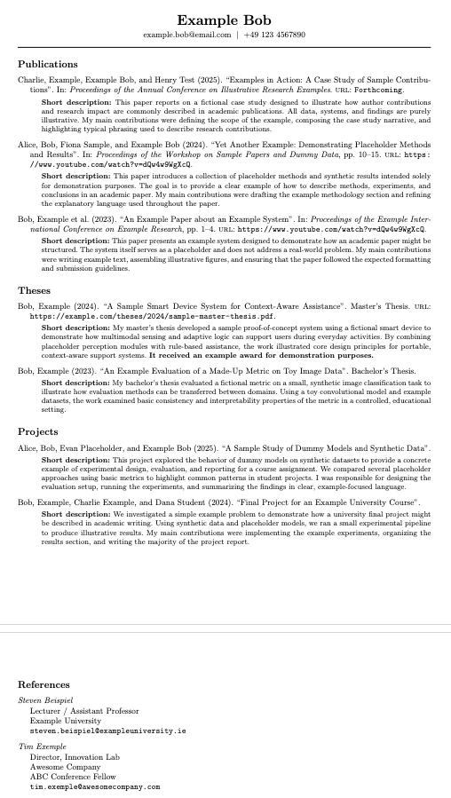

# LaTeX Publication List Template
A clean and customizable LaTeX template for academic publication lists, CVs, and research portfolios.

## Author
Lorenz Krause

### Description
This repository provides a customizable **LaTeX publication list template** for academic CVs, research profiles, and personal websites. The template supports clear differentiation between multiple types of scientific contributions—such as journal publications, theses, and projects—while maintaining a clean and professional layout.

Each scientific contribution **includes a short description**, ensuring concise explanations of individual entries. The template is fully **BibTeX-based** and includes code for attaching a consistently styled list of references.

### Usage
1. Clone or download the repository.
2. Add your publication data in BibTeX format to the `bib_files` directory.
   - You may add or remove `.bib` files as needed.
   - Update `main.tex` to include or exclude specific files.
3. Add the required short description for each scientific contribution as shown in the examples.
4. Compile `main.tex` using a LaTeX editor or command-line tool with BibTeX support.
5. Customize layout and styling by editing `main.tex`.

### Features
- LaTeX template for structured publication lists
- Supports multiple contribution types (publications, theses, projects, etc.)
- Mandatory short description for each entry
- BibTeX-based data management
- Clean and professional academic layout
- Easy customization via `main.tex`

### Example
Below is an example output generated using this template.  
The corresponding PDF can be found in the repository as `main.pdf`.

